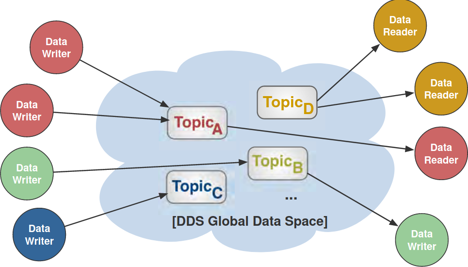
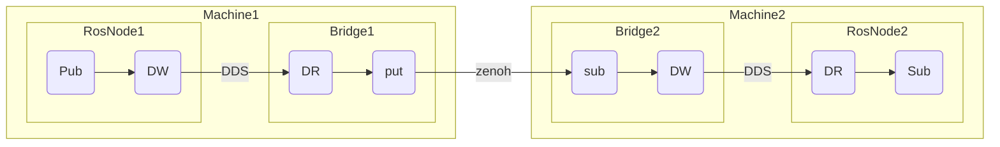
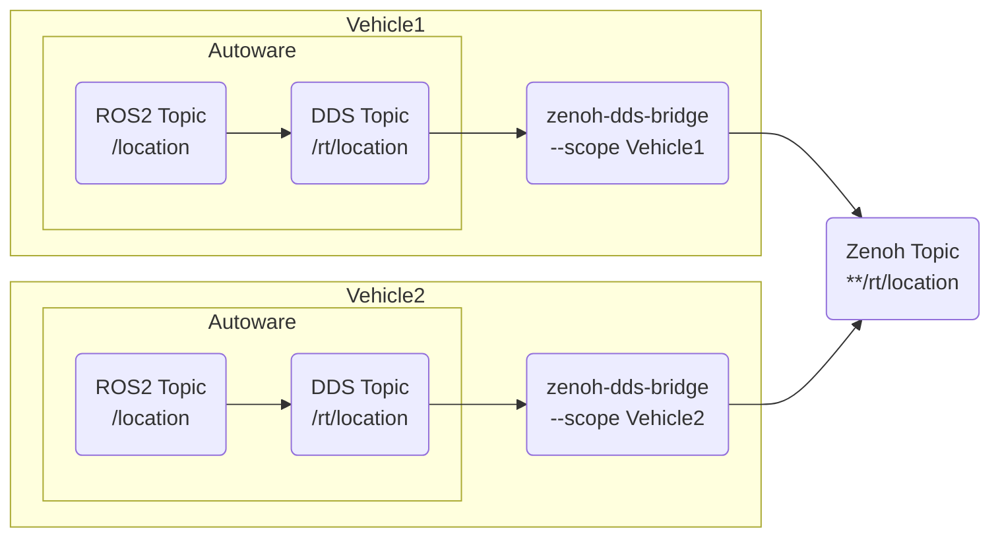
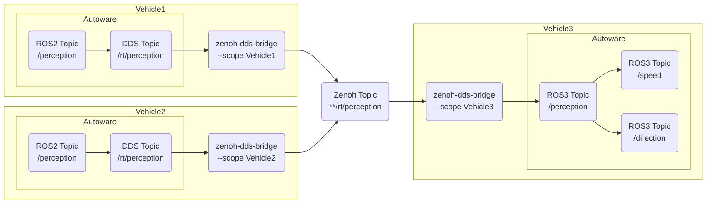
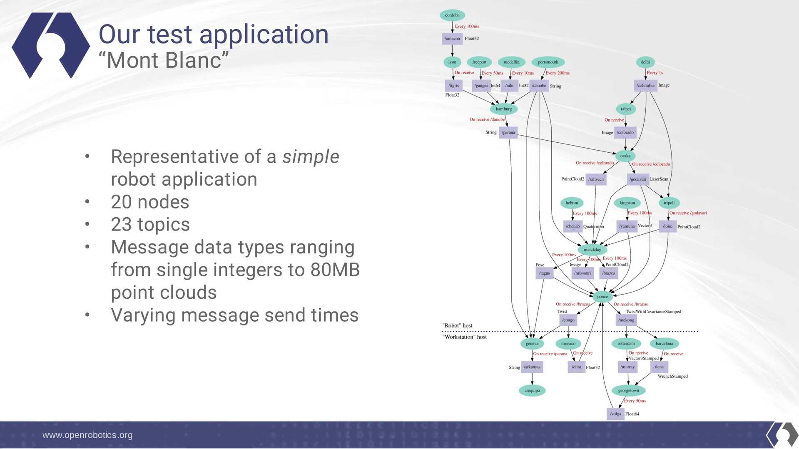
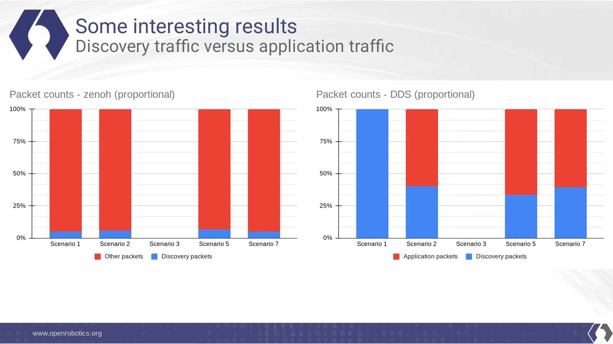

---
# try also 'default' to start simple
theme: seriph
# random image from a curated Unsplash collection by Anthony
# like them? see https://unsplash.com/collections/94734566/slidev
background: https://source.unsplash.com/collection/94734566/1920x1080
# apply any windi css classes to the current slide
class: 'text-center'
# https://sli.dev/custom/highlighters.html
highlighter: shiki
# show line numbers in code blocks
lineNumbers: false
# some information about the slides, markdown enabled
info: |
  ## Slidev Starter Template
  Presentation slides for developers.

  Learn more at [Sli.dev](https://sli.dev)
# persist drawings in exports and build
drawings:
  persist: false
# page transition
transition: slide-left
# use UnoCSS
css: unocss
---

# Zenoh Bridge DDS

2023-03-10

---
layout: image-right
image: https://images.unsplash.com/photo-1517247229957-6ae724c93b55?ixlib=rb-4.0.3&ixid=MnwxMjA3fDB8MHxwaG90by1wYWdlfHx8fGVufDB8fHx8&auto=format&fit=crop&w=687&q=80
---

# Outline

- Why we need to study the zenoh-plugin-dds?
- The probelms of V2V communication behind the DDS.
- What benefits does the zenoh-plugin-dds provide?

---

## Autoware

---
layout: two-cols
---

## Pros

- Perfect for wired LAN
- Highly customizable with fine QoS settings
- Low latency

## Cons

- Does not work over the internet
- Designed to work within a network with low message loss
- DDS storm can corrupt the wireless network
- Push-mode only

::right::

# DDS
Data Distribution Service

---

# Complexity of DDS Discovery
 

DDS discovery mechanism relies on

- **SPDP (Simple Participant Discovery Protocol)**, which is used to find who domain participants
- **SEDP (Simple Entity Discovery Protocol)**, which is used to exchange the information of data readers, data writers, and topics.

For $n$ participants each of which has $r$ readers and $w$ writers, the traffic scales with $n(n-1)(r+w)$.

---

# How Does Zenoh Solve Discovery Problem?

 

1. Only resource interests are advertised.
2. Resource interests can be generalized to compress discovery data.
3. Discovery message are extremely wire efficient.
4. The reliability (QoS) is set between runtimes instead of per entity as in DDS.

---

# How does Zenoh-plugin-DDS work?

 
 

* DW/DR: DDS DataWriter & DataReader

---

# Fleet Management

Commnuication can go through wireless environment

 

---

# Fleet Management

Leverage cooperative sensing with V2V Communication

 

---

### Benchmark Report from OpenRobotics

---

### Benchmark Report from OpenRobotics

---

# Comparison

|                      | **DDS** | **Kafka** | **MQTT** | **Zenoh** |
| -                    | -       | -         | -        | -         |
| Pub/Sub              | Push    | Pull      | Push     | Push/Pull |
| High Performance     | ✗       | ✗         | ✗        | ✔         |
| Distributed Query    | ✗       | ✗         | ✔        | ✔         |
| Constrained Hardware | ✗       | ✗         | ✔        | ✔         |
| Constrained Networks | ✗       | ✗         | ✗        | ✔         |
| Internet Scale       | ✗       | ✔         | ✔        | ✔         |
| Standard Based       | ✔       | ✗         | ✔        | ✗         |
| QoS                  | ✔       | ✗         | ✔        | ✔         |
| Peer-to-peer         | ✔       | ✗         | ✗        | ✔         |
| Brokered             | ✗       | ✔         | ✔        | ✔         |
| Routed               | ✗       | ✗         | ✗        | ✔         |

---

# Reference

- [Improving the communications layer of robot applications with ROS 2 and Zenoh by Geoffrey Biggs, Open Robotics](https://www.youtube.com/watch?v=1NE8cU72frk)
- [ROS2 Robot-to-Anything with Zenoh by Julien Enoch, ZettaScale](https://www.youtube.com/watch?v=9h01_MSKPS0)
- [Minimizing Discovery Overhead in ROS2](https://zenoh.io/blog/2021-03-23-discovery/)
- [FastDDS Discovery](https://fast-dds.docs.eprosima.com/en/v2.9.1/fastdds/discovery/simple.html)
